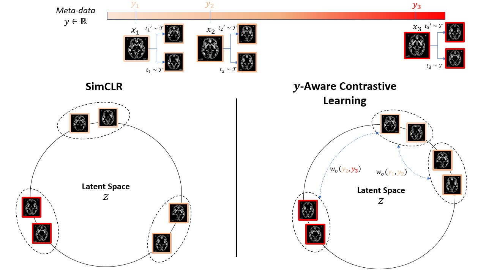
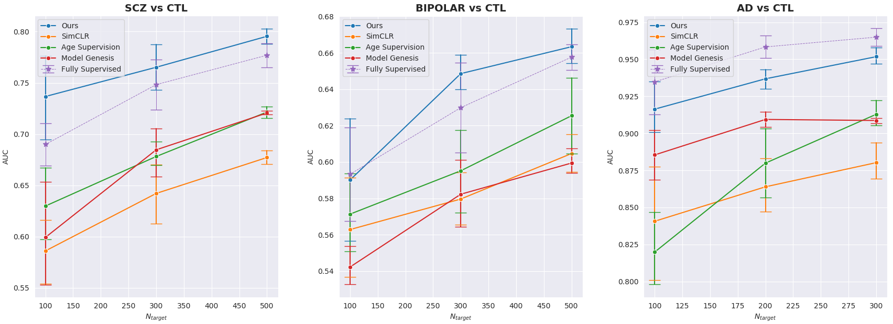
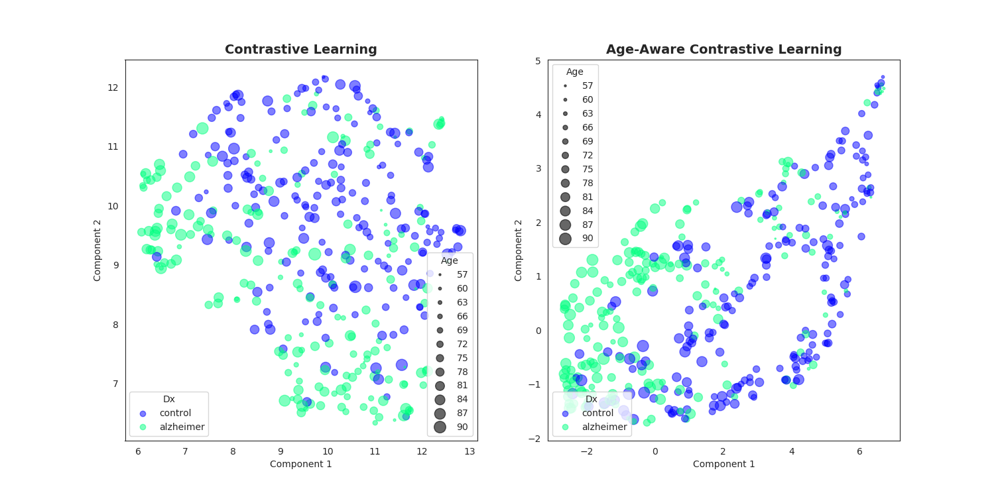

# y-Aware Contrastive Learning 
Official Pytorch Implementation for y-Aware Contrastive Learning (*MICCAI 2021*) [[paper]](https://hal.telecom-paris.fr/hal-03262256/document)

We propose an extension of the popular InfoNCE loss used in contrastive learning (SimCLR, MoCo, etc.) to the weakly supervised case where auxiliary information *y* is available for each image *x* (e.g subject's age or sex for medical images). We demonstrate a better data representation with our new loss, namely y-Aware InfoNCE. 




## Dependencies

+ python >= 3.6
+ pytorch >= 1.6
+ numpy >= 1.17
+ scikit-image=0.16.2
+ pandas=0.25.2

## Data

### BHB-10K dataset for pre-training

In the paper, we aggregated 13 MRI datasets of healthy cohorts pre-processed with [CAT12](http://www.neuro.uni-jena.de/cat/). You can find the complete list below.

**Source**  | **# Subjects**  | **# Sessions** | **Age** | **Sex (\%F)** | **# Sites**
:---: | :---: | :---: | :---: | :---: | :---: | 
[HCP](https://www.humanconnectome.org/study/hcp-young-adult)  | 1113 | 1113 | 29 ± 4 | 45 | 1
[IXI](http://brain-development.org/ixi-dataset) | 559 | 559 | 48 ± 16 | 55 | 3 
[CoRR](https://www.nitrc.org/projects/fcon_1000) | 1371 | 2897 | 26 ± 16 | 50 | 19
[NPC](https://openneuro.org/datasets/ds002330/versions/1.1.0) | 65 | 65 | 26 ± 4 | 55 | 1
[NAR](https://openneuro.org/datasets/ds002345/versions/1.0.1) | 303 | 323 | 22 ± 5 | 58 | 1
[RBP](https://openneuro.org/datasets/ds002247/versions/1.0.0) | 40 | 40 | 23 ± 5 | 52 | 1
[OASIS 3](https://www.oasis-brains.org) | 597 | 1262 | 67 ± 9 | 62 | 3
[GSP](https://dataverse.harvard.edu/dataset.xhtml?persistentId=doi:10.7910/DVN/25833) | 1570 | 1639 | 21 ± 3 | 58 | 1
[ICBM](https://ida.loni.usc.edu) | 622 | 977 | 30 ± 12 | 45 | 3
[ABIDE 1](http://fcon_1000.projects.nitrc.org/indi/abide) | 567 | 567 | 17 ± 8 | 17 | 20
[ABIDE 2](http://fcon_1000.projects.nitrc.org/indi/abide) | 559 | 580 | 15 ± 9 | 30 | 17
[Localizer](http://brainomics.cea.fr/localizer/localizer) | 82 | 82 | 25 ± 7 | 56 | 2
[MPI-Leipzig](https://openneuro.org/datasets/ds000221/versions/00002) | 316 | 316 | 37 ± 19 | 40 | 2
**Total** | 7764 | **10420** | 32 ± 19 | 50 | 74 

### Datasets for evaluation/fine-tuning

Originally, we have evaluated our approach on 3 classification target tasks with 2 public datasets (detailed below) and 
1 private one ([BIOBD](https://www.cambridge.org/core/journals/psychological-medicine/article/abs/lithium-prevents-grey-matter-atrophy-in-patients-with-bipolar-disorder-an-international-multicenter-study/6267A7E11F17EFDF5857F06E4C233D4F)).
We also pre-processed the T1-MRI scan with CAT12 toolbox and all the images passed a visual Quality Check (QC).

**Source**  | **# Subjects** | **Diagnosis** | **Age** | **Sex (\%F)** | **# Sites**
:---: | :---: | :---: | :---: | :---: | :---: | 
[ADNI-GO](http://adni.loni.usc.edu/about/adni-go)  | 387 | <p>Alzheimer<br>Control</p> | <p>75 ± 8<br>75 ± 5</p>  | <p>52<br>51</p>  | <p>57<br>57</p> 
[SCHIZCONNECT-VIP](http://schizconnect.org) | 605 | <p>Schizophrenia<br>Control</p> | <p>34 ± 12<br>32 ± 12</p>  | <p>27<br>47</p>  | <p>4<br>4</p>  

## Representation Quality
### Unsupervised Results


### UMAP Visualization




## Pre-training
First, you can clone this repository with:
``` bash 
$ git clone https://github.com/Duplums/yAwareContrastiveLearning.git
$ cd yAwareContrastiveLearning
```
### Download our pretrained model

You can download our DenseNet121 model pre-trained on BHB-10K [here](https://drive.google.com/file/d/1e75JYkaXvLQJhn0Km99iVTzB28AvErh5/view?usp=sharing). 
We have used only random cutout during pre-training and we used the hyperparameters defined by default in `config.py`.

### Pretraining your own model
#### Configuration

Then you can directly run the main script with your configuration in `config.py` including:
- the paths to your training/validation data
- the proxy label you want to use during training along with the hyperparameter sigma
- the network (critic) including a base encoder and a projection head which is here a simple MLP(2)  
``` python
self.data_train = "/path/to/your/training/data.npy"
self.label_train = "/path/to/your/training/metadata.csv"

self.data_val = "/path/to/your/validation/data.npy" 
self.label_val = "/path/to/your/validation/metadata.csv" 

self.input_size = (C, H, W, D) # typically (1, 121, 145, 121) for sMRI 
self.label_name = "age" # asserts "age" in metadata.csv columns 

self.checkpoint_dir = "/path/to/your/saving/directory/"
self.model = "DenseNet"
```
#### Running the model
Once you have filled `config.py` with the correct paths, you can simply run the DenseNet model with:
``` bash
$ python3 main.py --mode pretraining
```


## Fine-tuning your model
In order to fine-tune the model on your target task, do not forget to set the path to the downloaded file in `config.py`:
``` python
self.pretrained_path = "/path/to/DenseNet121_BHB-10K_yAwareContrastive.pth"
```
Then you can define your own Pytorch `Dataset` in  `main.py`:
```python
dataset_train = Dataset(...)
dataset_val = Dataset(...)
``` 

You can finally fine-tune your model with:
``` bash
$ python3 main.py --mode finetuning
``` 
